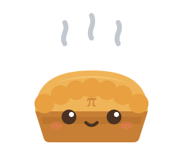
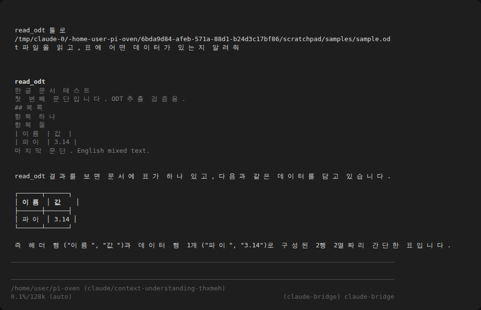

<p align="center">
  
</p>

# pi-oven

Where fresh pi packages are baked. `╭◕‿◕╮`

[pi coding agent](https://pi.dev)용 확장 패키지를 굽는 모노레포.
각 패키지는 독립적으로 npm에 배포되고, 이 오븐은 개발 허브다.

## Packages

| 패키지 | 설명 | 설치 |
|---|---|---|
| [pi-ui-kit](packages/pi-ui-kit) | 인터랙티브 선택 UI, 텍스트 프롬프트, OS 알림 + 마스코트 Pai | `pi install npm:pi-ui-kit` |
| [pi-hwp](packages/pi-hwp) | 한글 문서(.hwpx/.hwp 5.x) 텍스트·표 추출 + 내장 이미지 추출(비전 첨부는 옵션), 의존성 제로 | `pi install npm:pi-hwp` |
| [pi-odt](packages/pi-odt) | OpenDocument(.odt) 텍스트·표 추출 + 내장 이미지 추출(비전 첨부는 옵션), 의존성 제로 | `pi install npm:pi-odt` |

## 동작 모습

`read_odt`가 실제 pi 세션에서 실행된 모습 — 툴이 문서를 추출하고, 모델이 표를 해석한다:

<p align="center">
  
</p>

## 개발

```bash
npm install          # workspace 의존성 설치
npm run typecheck    # 전 패키지 타입 체크 (빌드 스텝은 없다 — pi가 TS를 직접 로드)
pi -e ./packages/pi-ui-kit   # 로컬에서 바로 실행
```

## 새 패키지 굽는 법

1. `packages/<이름>/` 디렉토리에 `package.json`(keywords에 `"pi-package"`, `"pi": { "extensions": ["./extensions"] }` 필드 필수)과 `extensions/*.ts`를 만든다.
2. `npm run typecheck`가 통과하고 `pi -e ./packages/<이름>`으로 로드되는지 확인한다.
3. 루트 README의 Packages 표에 한 줄 추가하고, `npm publish`로 배포한다.

## Pai

pi-oven의 마스코트. 갓 구워져 아직 김이 나는 파이.
pi-ui-kit을 설치하면 세션 시작마다 헤더에서 마중 나온다.

```
   °  o            °  o
 ╭◠◠◠◠◠◠◠╮       ╭◠◠◠◠◠╮
 │ ◕ ᵕ ◕ │       │ ◕‿◕ │      ╭◕‿◕╮
 ╰───────╯       ╰─────╯
   full            mini        inline
```

- 모든 글리프는 pi-tui `visibleWidth` 기준 폭 1 — 어떤 확장의 박스 안에 넣어도 정렬이 깨지지 않는다.
- 김(`° o ·`)의 위치를 프레임마다 바꾸면 idle 애니메이션, 눈을 `◕ → ˘`로 바꾸면 깜빡임이 된다.
- 테마 적용: 크러스트(`◠`, 테두리)는 `theme.fg("accent")`, 김은 `theme.fg("dim")`.
